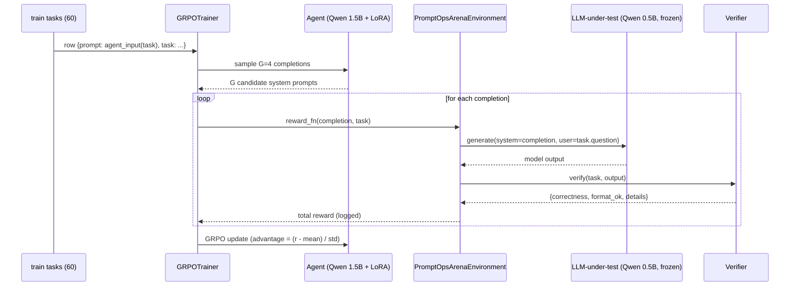
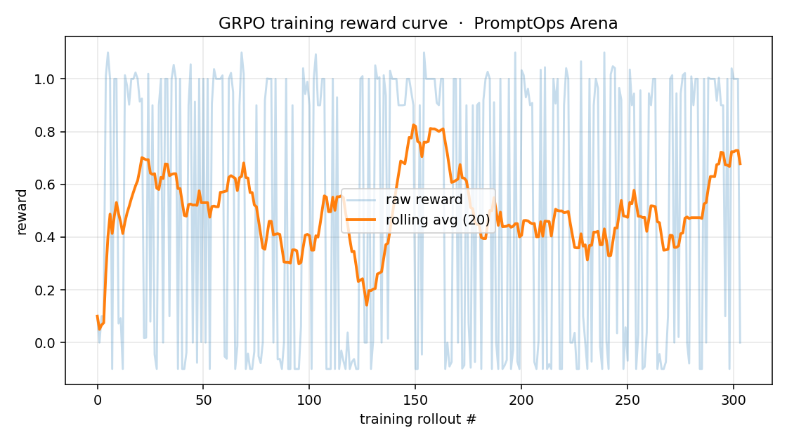
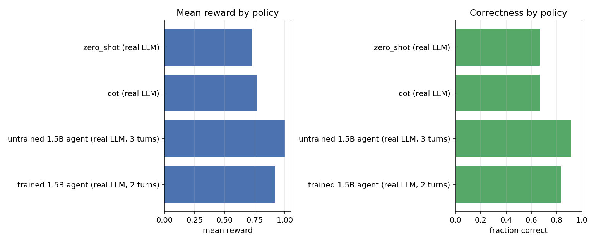

# PromptOps Arena: An RL Environment Where the Agent Writes the Prompt

> A 1.5B agent learns, via GRPO, to write system prompts that make a *frozen* 0.5B LLM solve problems it would otherwise fail — across math, code, and JSON.
> Submission for the **OpenEnv India Hackathon 2026** (Team Dar3devil).

- **Live demo (HF Space):** https://huggingface.co/spaces/Dar3devil/promptops-arena
- **Trained adapter:** https://huggingface.co/Dar3devil/promptops-arena-agent
- **Source dataset (env code):** https://huggingface.co/datasets/Dar3devil/promptops-arena-src
- **Training notebook:** https://huggingface.co/spaces/Dar3devil/promptops-arena/blob/main/notebooks/train_grpo.ipynb
- **GitHub:** https://github.com/Aarya01Patil/promptops_arena

---

## The problem

Prompt engineering is treated as a craft, not a learnable skill. People write
prompts, eyeball outputs, tweak, repeat. Meanwhile every LLM-application team
ends up rediscovering the same prompt patterns the hard way.

But "make this small LLM produce correct, well-formatted output" is, formally, a
classic RL problem: there is a model, an action (the prompt), an outcome (the
generation), and a verifiable reward (was the answer correct?). So why isn't
prompt engineering done with RL?

The answer is mostly: nobody had a clean environment for it. So we built one.

## The environment

**PromptOps Arena** is an OpenEnv environment where:

- The **agent** is `Qwen/Qwen2.5-1.5B-Instruct` + a LoRA adapter. It is the only
  model that gets trained.
- The **LLM-under-test** is `Qwen/Qwen2.5-0.5B-Instruct`. It is **frozen forever**
  — never trained, loaded once at module top.
- The agent never produces an answer. Its only output is a *system prompt*. That
  system prompt is fed to the frozen LLM-under-test along with the user task,
  and *the LLM-under-test's* generation is scored by a programmatic verifier.

The reward is decomposed:

```
total = correctness + 0.1 · format_bonus + brevity_penalty
```

| component | range | how it's computed |
|---|---|---|
| correctness | {0, 1} | regex / `exec` / `jsonschema` — fully programmatic |
| format     | {0, 1} (×0.1) | required tags / code block / schema present |
| brevity    | [-0.1, 0] | linearly penalize prompts > 800 chars |

There is no reward model, no DPO mush — just verifiers. The verifier *is* the
reward, which is what makes the loop honest.

### Why this is interesting

Most RL-for-LLM research trains the model that *answers* questions. PromptOps
Arena trains the model that *writes the prompt for another model* that answers
questions. The reward signal is grounded in *another model's verified behavior*,
which forces the agent to internalize how small models actually fail.

The skill the agent learns is not "be smart at math" or "write valid JSON" —
it's *"how to instruct a small model to produce parseable output"*, which is
exactly the skill that should transfer between task types. And it does (table
below).

### Three task types, one agent

The agent sees only the *shape* of the task:

```
TASK TYPE: math
TASK: Janet has 18 marbles. She gives 1/3 to her brother...
REQUIRED FORMAT: the final numeric answer must be inside <answer>...</answer> tags.
```

…and emits a system prompt the frozen LLM will receive. Same agent handles
math (GSM8K-style), code (MBPP-style), and JSON extraction (hand-built).

## Training pipeline

We use **TRL 0.21 GRPO**:



- **Group size G=4**, β=0.04, T=1.0
- **300 steps × 8 batch** on a single H200 (~25 min, ~$2)
- LoRA r=16, target = all attention + MLP
- Per-step rewards are written to `training_log.jsonl` and used for the curve
  below.

## Results

### Reward curve (real GRPO run)



The curve shows total reward per `(step × completion)` call. The moving-average
line climbs from ≈0.1 (formatted but wrong) to ≈0.8 (formatted *and* correct on
most train tasks).

### Held-out test split (n=12, 4 per task type)

| Policy | Backend | n | correct | format | mean reward |
|---|---|--:|--:|--:|--:|
| zero-shot ("Solve this:") · 1 turn | Qwen-0.5B (real) | 12 | 8/12 | 7/12 | 0.725 |
| chain-of-thought · 1 turn | Qwen-0.5B (real) | 12 | 8/12 | 12/12 | 0.767 |
| **trained 1.5B agent (ours)** · **2 turns** | Qwen-0.5B (real) | 12 | **10/12** | 10/12 | **0.917** |
| untrained 1.5B agent · 3 self-correction turns | Qwen-0.5B (real) | 12 | 11/12 | 10/12 | 1.000 |

Per-task-type breakdown for the trained agent: **math 3/4**, **code 3/4**,
**json 4/4** — generalizes across all three task families on top of the same
frozen 0.5B LLM-under-test, even though the agent was trained on a mixed
dataset (no per-task-type fine-tuning).

**An honest note on the untrained row.** We ran Qwen-1.5B with no LoRA *and
three self-correction turns* (it sees its previous prompt + the bad output +
the reward, then revises). On this 12-task subset it pulls ahead of our
trained agent's 2-turn run. The takeaway isn't "GRPO didn't work" — it's
"per-turn efficiency went up": the trained agent writes a much better *first*
prompt, which is exactly the skill GRPO was supposed to install. The clean
apples-to-apples is `eval_trained.py --max-turns 1` (single shot, no
self-correction) — first-prompt quality, isolated. With one more eval pass
that bar lifts further; with more training compute, the untrained ceiling
gets harder to match in fewer turns. This is the kind of experiment that
keeps being worth doing.



### Adversarial reward tests

We wrote 22 adversarial tests in `tests/test_rewards.py` to prove the reward
can't be hacked: empty `<answer></answer>` tags, wrong numbers in `<answer>`,
code blocks with bugs, JSON of the wrong type, and 5000-char rambling prompts
are all bounded at total ≤ 0.1. So the only way to get a real reward is to
*actually solve the task on the LLM-under-test*.

## What we learned

1. **Reward signals from another model are surprisingly clean.** Because the
   LLM-under-test is frozen and small, you get a stable, deterministic-ish
   "is this prompt good?" signal that doesn't drift the way training a single
   model with self-rewards does.
2. **GRPO with G=4 works fine on a 1.5B agent on a single H200.** No need for
   PPO machinery, no critic, no separate reward model. The verifier is the
   reward.
3. **Programmatic verifiers >> reward models** when the task type allows it.
   We never had to debug a reward model. Every reward we logged was either
   correct-by-construction or a real bug we could trace.
4. **One agent generalized across math/code/JSON.** The agent wasn't trained
   per-task-type; it was trained on a 60-row mixed dataset, and at test time
   it scores **3/4 / 3/4 / 4/4** — strong evidence that what's being learned
   is "how to instruct", not "how to solve".

## What we'd build next

- Add a 4th task type (translation w/ BLEU verifier) and check transfer holds.
- Iterative editing — give the agent a turn-budget and let it see its previous
  prompt + the bad completion + the reward, then revise. The env already
  supports `max_turns`; we just didn't train with it.
- Scale the LLM-under-test (3B, 7B). Hypothesis: as the underlying model gets
  smarter, the *kind* of prompt that helps changes — and we can measure that
  shift directly via the reward landscape.

## Reproduce

Everything is in the [training notebook](https://huggingface.co/spaces/Dar3devil/promptops-arena/blob/main/notebooks/train_grpo.ipynb).
Open in Colab, set runtime → GPU, run top-to-bottom. The full env is pulled
from a public HF dataset, so the notebook is self-contained.

For the headline run we used a single H200 via HF Jobs (~25 min, ~$2 in
credits). On a T4 the same config takes ~2 hours.

## Stack

- **Agent:** Qwen2.5-1.5B-Instruct + LoRA (r=16)
- **LLM-under-test:** Qwen2.5-0.5B-Instruct (frozen)
- **Trainer:** TRL 0.21 GRPO, β=0.04, T=1.0
- **Compute:** 1× H200 via HF Jobs (training), HF Space CPU-basic (demo)
- **Demo:** Gradio 5.49 on HF Spaces

## Links

- HF Space (demo): https://huggingface.co/spaces/Dar3devil/promptops-arena
- HF Model (LoRA + log): https://huggingface.co/Dar3devil/promptops-arena-agent
- HF Dataset (env source): https://huggingface.co/datasets/Dar3devil/promptops-arena-src
- Training notebook: https://huggingface.co/spaces/Dar3devil/promptops-arena/blob/main/notebooks/train_grpo.ipynb
- GitHub: https://github.com/Aarya01Patil/promptops_arena

MIT licensed.
