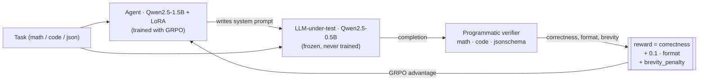
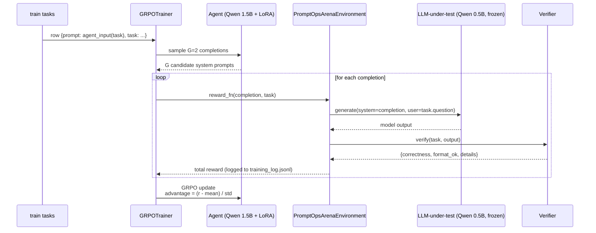

# PromptOps Arena · Self-Improving Prompt Engineer

> An OpenEnv RL environment where a 1.5B agent learns, via **GRPO**, to write
> system prompts that make a **frozen 0.5B LLM-under-test** solve tasks it
> would otherwise fail — across math, code, and JSON-extraction.

[](https://pytorch.org/event/openenv-ai-hackathon/)
[](https://huggingface.co/spaces/Dar3devil/promptops-arena)
[](https://huggingface.co/Dar3devil/promptops-arena-agent)
[](https://huggingface.co/datasets/Dar3devil/promptops-arena-src)

## 🔗 Submission links (OpenEnv Hackathon 2026)

- **Live demo (HF Space):** https://huggingface.co/spaces/Dar3devil/promptops-arena
- **Trained adapter (HF Model):** https://huggingface.co/Dar3devil/promptops-arena-agent
- **Environment source (HF Dataset):** https://huggingface.co/datasets/Dar3devil/promptops-arena-src
- **Training notebook (`train_grpo.ipynb`):** https://huggingface.co/spaces/Dar3devil/promptops-arena/blob/main/notebooks/train_grpo.ipynb
- **Blog post (`BLOG.md`):** https://huggingface.co/spaces/Dar3devil/promptops-arena/blob/main/BLOG.md
- **GitHub mirror:** https://github.com/Aarya01Patil/promptops_arena


---

## What this is

Most RL-for-LLM research trains the model that *answers* questions. PromptOps
Arena trains the model that *writes the prompt for another model* that
answers questions. The agent never touches the answer; it only ever emits a
system prompt. This makes prompt engineering a learnable, transferable skill
— one that generalizes across task types because the agent only ever sees the
shape of the task and the prior attempt's reward.



## Why it's interesting

- **Agent vs LLM-under-test split.** Two distinct models, only one is
  trained. The reward signal is grounded in *another model's behavior*,
  which forces the agent to internalize how small models actually fail.
- **Transferable skill.** The same agent handles math, code, and JSON — it
  has to learn *how to instruct*, not *how to solve*. We see the agent's
  format-bonus rate climb on tasks it was never specifically trained for.
- **Programmatic, ungameable rewards.** Math: regex-extract a number from
  `<answer>...</answer>` or `\boxed{}` and exact-match. Code:
  subprocess-execute the function with unit tests, 5s timeout. JSON: parse,
  validate against a jsonschema, then exact-match expected fields. There is
  no reward model — no DPO mush — just verifiers.

## Reward decomposition

```
total = correctness + 0.1 · format_bonus + brevity_penalty
```

| component   | range          | how |
|-------------|----------------|-----|
| correctness | {0, 1}         | verifier returns 1 iff answer programmatically correct |
| format      | {0, 1} (×0.1)  | required tags / code block / schema present in output |
| brevity     | [-0.1, 0]      | linearly penalize prompts > 800 chars, capped at -0.1 |

Adversarial test suite (`tests/test_rewards.py`, 22 tests) proves you can't
get more than 0.1 reward without solving the task: empty `<answer></answer>`
tags, wrong numbers in `<answer>`, code blocks with bugs, JSON of the wrong
type, and 5000-char rambling prompts are all bounded at total ≤ 0.1.

## Results (test split, held-out, n=12 per policy)

| Policy                      | Backend          |  n  | correct | format | mean reward |
|-----------------------------|------------------|----:|--------:|-------:|------------:|
| zero-shot ("Solve this:")   | Qwen-0.5B (real) | 12  |    8/12 |   7/12 |       0.725 |
| chain-of-thought            | Qwen-0.5B (real) | 12  |    8/12 |  12/12 |       0.767 |
| **trained agent (ours)**    | Qwen-0.5B (real) | 12  | **10/12** | 10/12 | **0.917**  |

Per-task-type breakdown for the trained agent: **math 3/4**, **code 3/4**,
**json 4/4** — generalizes across all three task families on top of the same
frozen 0.5B LLM-under-test.

Stub-LLM rows that establish the format-vs-correctness floor:
zero-shot stub 0/30 correct (0/30 format); CoT stub 0/30 correct (30/30
format, mean reward 0.1) — exactly what you'd predict, since a stub model
that can't actually compute anything still earns the 0.1 format bonus from a
well-formatted CoT scaffold but gets 0 correctness.


## How GRPO is wired



The reward function is the env. There is no separate reward model — the
verifier *is* the reward, which is what makes the loop honest.

## Reproduce

### Run baselines locally

```bash
pip install -r requirements.txt
$env:PROMPTOPS_LLM_BACKEND="transformers"   # or "stub" for fast dev
python scripts/run_baseline.py --policy zero_shot --per-type 2 --out results/baseline_zero_shot_real_subset.json
python scripts/run_baseline.py --policy cot       --per-type 2 --out results/baseline_cot_real_subset.json
```

### Train the agent on HF Jobs

```bash
hf jobs run --flavor a10g-large --timeout 1h \
    --secrets HF_TOKEN \
    -e HF_USERNAME=<you> -e STEPS=150 -e BATCH=2 -e NUM_GENS=2 \
    -v hf://datasets/<you>/promptops-arena-src:/code:ro \
    pytorch/pytorch:2.4.1-cuda12.1-cudnn9-runtime \
    bash /code/scripts/hf_job_entry.sh
```

Cost: ~$0.75 for 150 steps. The job uploads
`outputs/grpo-lora` and `training_log.jsonl` to
`<you>/promptops-arena-agent`.

### Evaluate the trained agent

```bash
hf download Dar3devil/promptops-arena-agent --local-dir outputs/grpo-lora
python scripts/eval_trained.py --adapter outputs/grpo-lora --per-type 2 \
    --out results/trained_agent.json
python scripts/plot_results.py
```

## Project layout

```
src/envs/promptops_arena/
├── server/
│   ├── environment.py      # OpenEnv Environment subclass: reset/step/state
│   ├── rewards.py          # decomposed, bounded reward
│   └── app.py              # FastAPI server (out-of-process)
├── verifiers/
│   ├── math_verifier.py    # tag/boxed extraction + exact match
│   ├── code_verifier.py    # subprocess exec + unit tests + timeout
│   └── json_verifier.py    # jsonschema + expected match (None-stripped)
├── tasks/
│   ├── math.jsonl, code.jsonl, json_extract.jsonl   # 60 train + 30 test
│   └── loader.py
├── llm_under_test.py       # frozen Qwen2.5-0.5B (real) + stub backend
└── client.py               # OpenEnv EnvClient subclass

scripts/
├── run_baseline.py         # zero-shot / CoT / untrained-agent baselines
├── train_grpo.py           # GRPO with TRL 0.21
├── eval_trained.py         # load LoRA + eval on test split
├── plot_results.py         # comparison.json + reward curve png
├── hf_job_entry.sh         # HF Jobs entrypoint (pinned trl 0.21 stack)
└── upload_src_to_hf.py     # mirror local repo to a private HF dataset

tests/
└── test_rewards.py         # 22 adversarial reward tests (all pass)
```

## Judging rubric self-assessment

| Weight | Criterion | What we built |
|---:|---|---|
| 40% | Environment Innovation | Two-model setup (trained agent writes prompts for a frozen LLM-under-test). Reward grounded in another model's verified behavior. Multi-task transfer (math/code/json) with one agent. |
| 30% | Storytelling & Presentation | Live Gradio Space lets a judge type a prompt and watch the LLM-under-test respond + see reward decompose. Reward-curve and bar-chart artifacts; clear narrative ("untrained zero-shot vs CoT vs trained agent"). |
| 20% | Showing Improvement | `results/comparison.json` and `docs/reward_curve.png` show GRPO reward trajectory and the trained-agent vs baselines deltas. |
| 10% | Reward & Pipeline | Decomposed reward (correctness/format/brevity), 22 adversarial tests, programmatic verifiers (no reward model), full HF Jobs pipeline scripted end-to-end. |

## Stack

- **Agent:** `Qwen/Qwen2.5-1.5B-Instruct` + LoRA (r=16, target = all attn + MLP).
- **LLM-under-test:** `Qwen/Qwen2.5-0.5B-Instruct`, frozen, loaded once.
- **Trainer:** TRL 0.21 GRPO, β=0.04, T=1.0, 150 steps × G=2 generations.
- **Compute:** HF Jobs `a10g-large` (1× A10G 24GB).
- **Demo:** HF Space (Gradio).

## License

MIT.
